## 文件夹

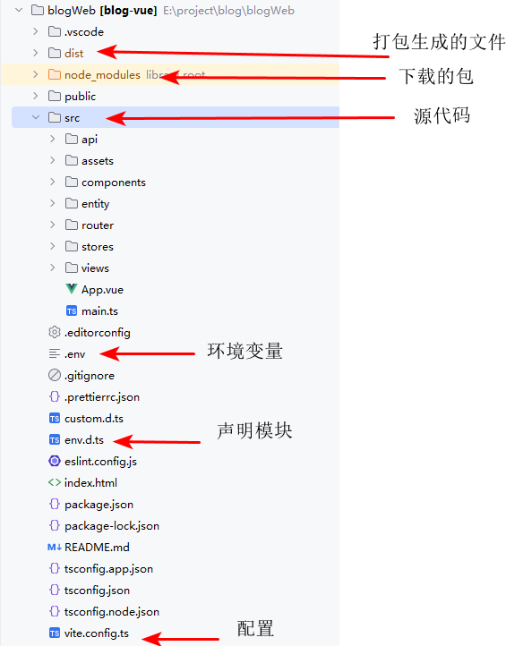

## 源代码

### api 接口后端

设置base url '/api'， 地址为http://localhost:port/api

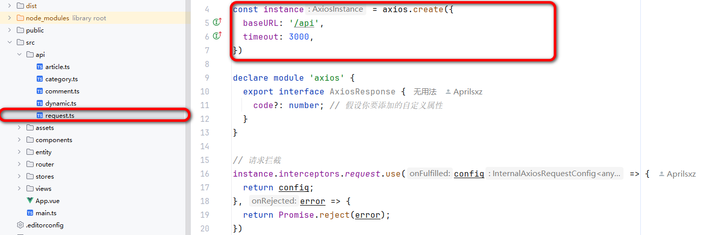

拼接地址，为http://localhost:port/api/acticle

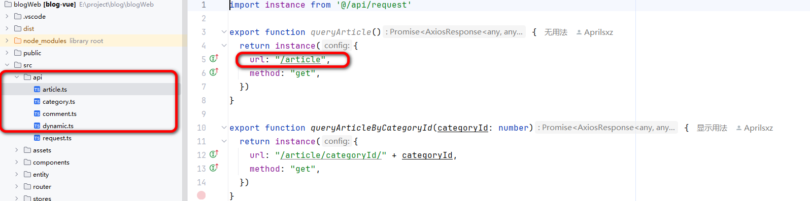

设置代理，将含'/api'的地址转发为target, 地址为‘target/api/article’，解决跨域问题

'/images'同理，且用rewrite 函数去除‘/images’字符串

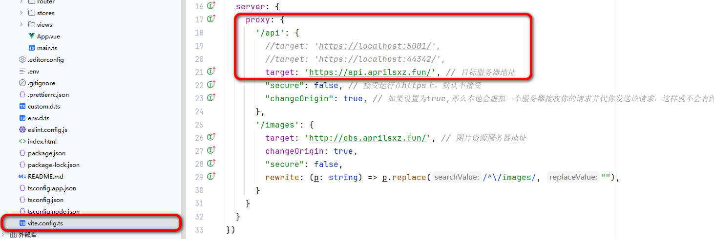

### router 路由

App.vue主页面，定义的路由页面会显示在router-view中

在此页面中写好导航栏，底部

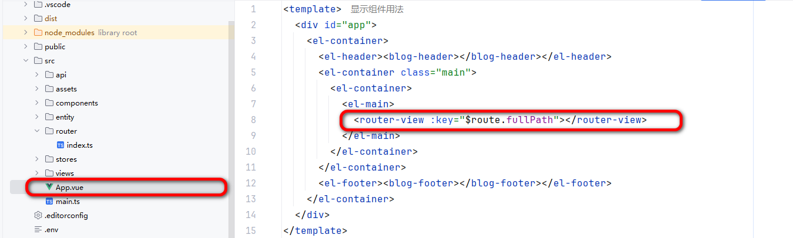

路由文件， path为地址，name为名称，component为组件页面

'/template'的路由页面会直接显示在App.vue中

'/template'下的‘/’页面会显示在'/template'的路由页面中

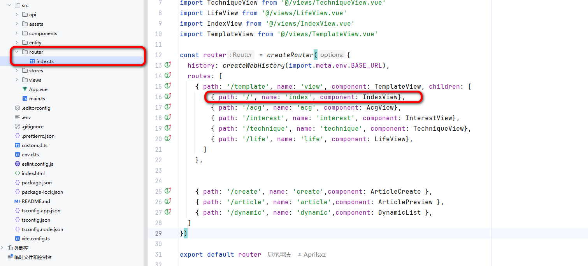

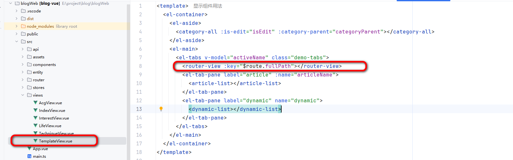

### views 页面

普通页面，在其中引入组件

### components 组件页面

实现一些小的组件，如导航栏，在views的页面中直接引入

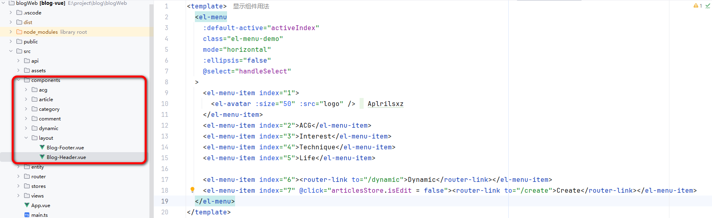

##### article组件

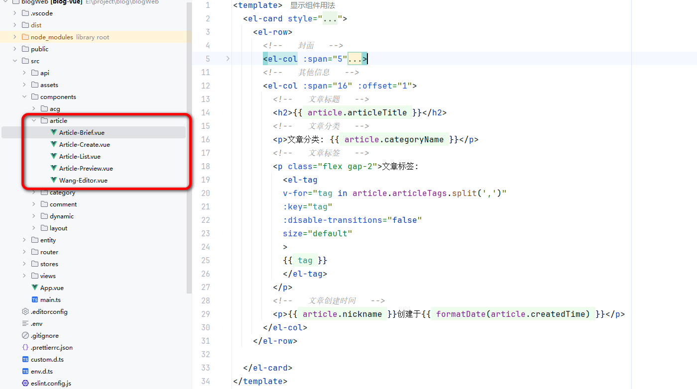

###### article-brief 文章简略信息

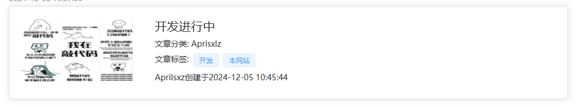

###### article-create 文章创建

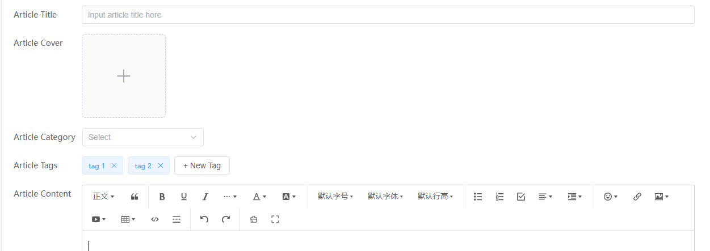

###### article-list 文章列表

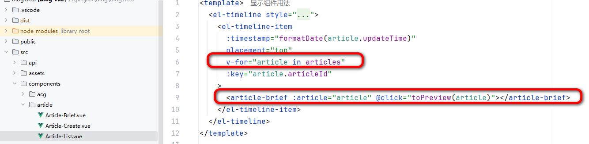

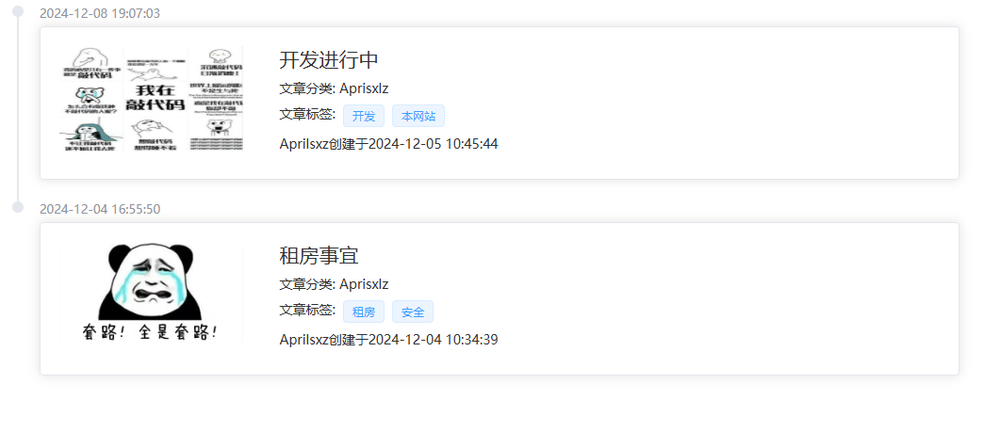

###### article-preview 文章详情 集成文章-以及评论

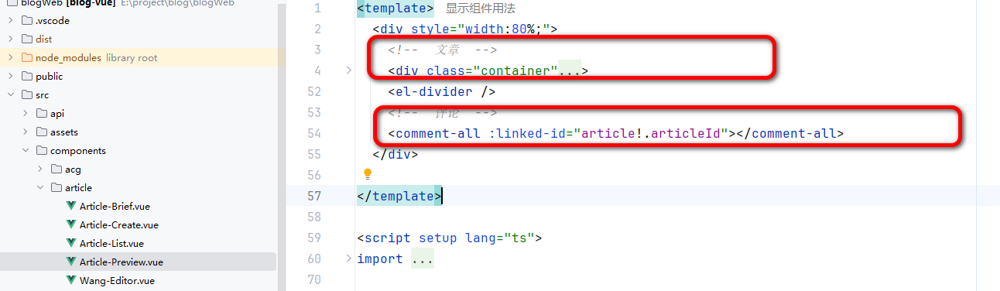

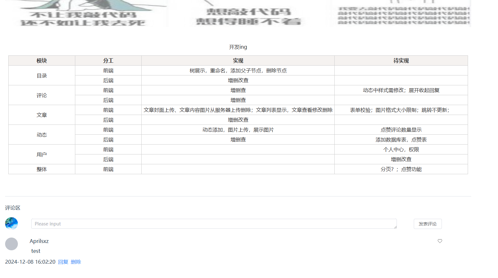

###### wang-editor 编辑器

### stores 存储

对数据进行状态管理，监听数据变化（方便组件间传递数据）

如 对当前目录，目录是否能够编辑，当前目录的父目录三个数据进行保存，并且存储到session中

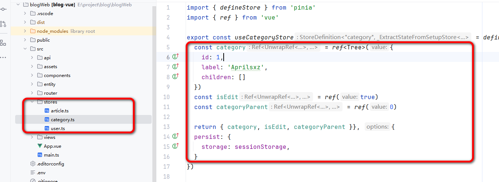

在目录组件中，点击目录即修改store中的值

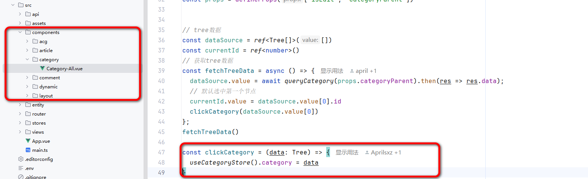

在文章组件中，获取存储的值并进行监听，从而修改文章列表

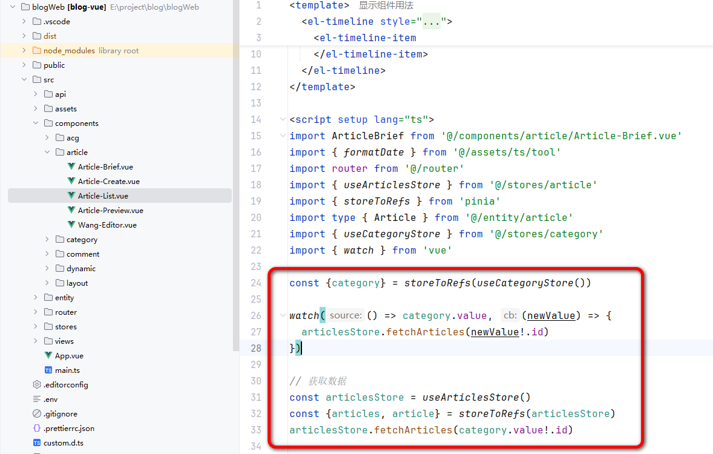

### entity 定义接口

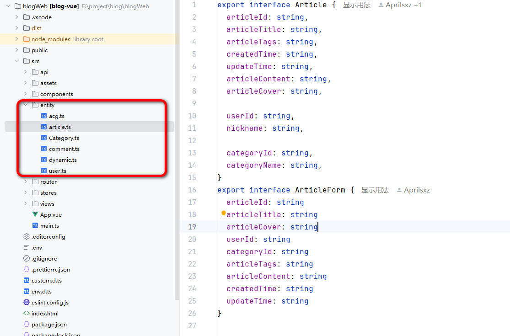

### asserts 静态资源

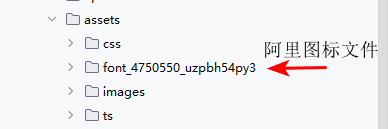
